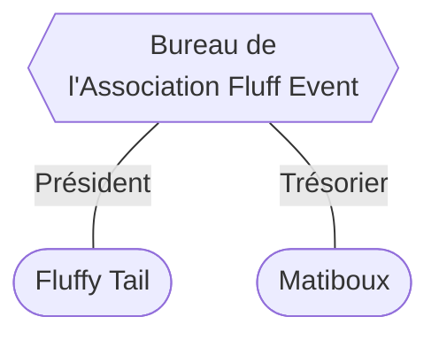

# Bureau de l'Association Fluff Event

_Mis à jour le 30 novembre 2024._

Le Bureau est l'organe exécutif administratif de l'Association Fluff Event.

Au 30 novembre 2024, le Bureau compte 2 membres.

---

---

**Situation au 19 août 2024**

Suite à l'Assemblée Générale Ordinaire du 18 août 2024, la composition du Bureau est la suivante :

- **Fluffy Tail**, à la fonction de **Président**.
  - Membre fondateur de l'Association.
  - Membre réélu le 18 août 2024 par l'Assemblée Générale Ordinaire du 18 août 2024.

- **Matiboux**, à la fonction de **Trésorier**.
  - Membre élu le 18 août 2024 par l'Assemblée Générale Ordinaire du 18 août 2024.
