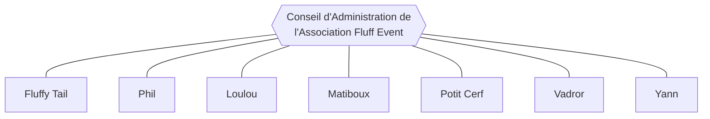

# Conseil d'Administration de l'Association Fluff Event

_Mis à jour le 30 novembre 2024._

Le Conseil d'Administration est l'organe décisionnel administratif de l'Association Fluff Event.

Au 30 novembre 2024, le Conseil d'Administration compte 7 membres.

---

---

**Situation au 19 août 2024**

Suite à l'Assemblée Générale Ordinaire du 18 août 2024, la composition du Conseil d'Administration est la suivante :

- **Fluffy Tail**
  - Membre fondateur de l'Association.
  - Membre réélu le 18 août 2024 par l'Assemblée Générale Ordinaire du 18 août 2024.
  - Mandaté jusqu'au 18 août 2026.

- **Phil**
  - Membre fondateur de l'Association.
  - Membre élu le 5 avril 2023 par l'Assemblée Générale Constitutive du 5 avril 2023.
  - Mandaté jusqu'au 5 avril 2025.

- **Loulou**
  - Membre élu le 18 août 2024 par l'Assemblée Générale Ordinaire du 18 août 2024.
  - Mandaté jusqu'au 18 août 2026.

- **Matiboux**
  - Membre élu le 18 août 2024 par l'Assemblée Générale Ordinaire du 18 août 2024.
  - Mandaté jusqu'au 18 août 2026.

- **Potit Cerf**
  - Membre élu le 18 août 2024 par l'Assemblée Générale Ordinaire du 18 août 2024.
  - Mandaté jusqu'au 18 août 2026.

- **Vadror**
  - Membre élu le 18 août 2024 par l'Assemblée Générale Ordinaire du 18 août 2024.
  - Mandaté jusqu'au 18 août 2026.

- **Yann**
  - Membre élu le 18 août 2024 par l'Assemblée Générale Ordinaire du 18 août 2024.
  - Mandaté jusqu'au 18 août 2026.
